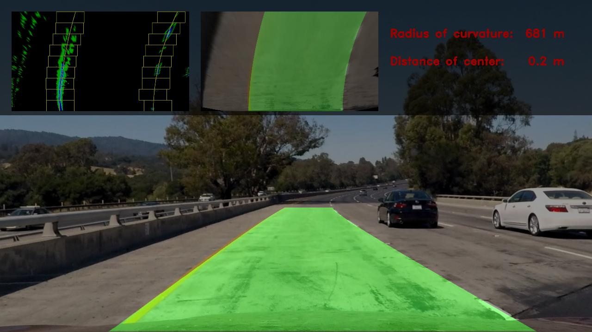

# Advanced Lane Finding


## The Project

The goals / steps of this project are the following:

* Compute the camera calibration matrix and distortion coefficients given a set of chessboard images.
* Apply a distortion correction to raw images.
* Use color transforms, gradients, etc., to create a thresholded binary image.
* Apply a perspective transform to rectify binary image ("birds-eye view").
* Detect lane pixels and fit to find the lane boundary.
* Determine the curvature of the lane and vehicle position with respect to center.
* Warp the detected lane boundaries back onto the original image.
* Output visual display of the lane boundaries and numerical estimation of lane curvature and vehicle position.


## Source Codes and Files

- `camera_cal/` Directory with calibration images
- `test_images/` Directory with test images
- `output_images/` Directory with test images with detected lanes
- `output_videos/` Directory with output videos
- `AdvancedLaneFinding.ipnyb` Jupyter notebook with all the project code and example images
- `README.md` Projecte writeup


## Camera Calibration

In order to use the images from the front facing camera, firstly we have to calibrate the images so we can correctly measure distances between features in the image. To do this, a class `CameraCalibration` has been created to conduct this process, which can calculate the calibration matrix and distortion coefficients for the camera given a set of chessboard images.

(1) Prepare a pattern variable to hold the coordinates of the chessboard's squares

```python
pattern = np.zeros((pattern_size[1] * pattern_size[0], 3), np.float32)
pattern[:, :2] = np.mgrid[0:pattern_size[0], 0:pattern_size[1]].T.reshape(-1, 2)
```

(2) Loop through each image, convert it to grayscale, and try to find the chessboard corners with `OpenCV` `findChessboardCorners` function.

```python
image = mpimg.imread(path)
# convert to grayscale
gray = cv2.cvtColor(image, cv2.COLOR_RGB2GRAY)
# find the chessboard corners
f, corners = cv2.findChessboardCorners(gray, pattern_size, None)
```

If the corners could be found, they are added to `objpoints` and `imgpoints` for later using them to calibrate the camera

```python
if f:
    objpoints.append(pattern)
    imgpoints.append(corners)
    image_size = (image.shape[1], image.shape[0])
```

(3) Calibrate the camera and get camera matrix and distortion coefficients

```python
matrix, dist = cv2.calibrateCamera(objpoints, imgpoints, image_size, None, None)
```

Some images were not possible to identify the corners, they are used to test the calibration:
Here's one example:


> For full implementation details please refer to the [jupyter notebook](AdvancedLaneFinding.ipynb)

## Color Transform

A series of image manipulation techniques are used to detect the edges, lines, of an image

(1) Get the **gradient absolute value** using `OpenCV` Sobel operator

```python
sobel = np.absolute(cv2.Sobel(image, cv2.CV_64F, 1, 0, ksize=sobel_ksize))
```

(2) Calculate the **gradient magnitude**

```python
x = cv2.Sobel(image, cv2.CV_64F, 1, 0, ksize=sobel_ksize)
y = cv2.Sobel(image, cv2.CV_64F, 0, 1, ksize=sobel_ksize)

magnit = np.sqrt(x**2 + y**2)
```

and the **gradient direction**

```python
x = cv2.Sobel(image, cv2.CV_64F, 1, 0, ksize=sobel_ksize)
y = cv2.Sobel(image, cv2.CV_64F, 0, 1, ksize=sobel_ksize)

direct = np.arctan2(np.absolute(y), np.absolute(x))
```

(3) Extract the `S` channel from the `HLS` color space and apply a threshold to it

```python
# Convert to HLS space
hls = cv2.cvtColor(np.copy(image), cv2.COLOR_RGB2HLS).astype(np.float)
# Separate and get the S channel
s = hls[:, :, 2]

mask = np.zeros_like(image)
mask[(image >= threshold[0]) & (image <= threshold[1])] = 1
```

Apply all these transformations to identify the edges on the lane lines, here's an example:


> For full implementation details please refer to the [jupyter notebook](AdvancedLaneFinding.ipynb)

## Perspective Transform

By defining a matrix of source and destination points in the images, transform them to the "bird's eye view" using `OpenCV` `getPerspectiveTransform` function.

Here are the defined vertices for the "region of interest"

```python
height = image.shape[0]
width = image.shape[1]
# Vertices coordinates in the source image
s1 = [width // 2 - 76, height * 0.625]
s2 = [width // 2 + 76, height * 0.625]
s3 = [-100, height]
s4 = [width + 100, height]
src = np.float32([s1, s2, s3, s4])
# Vertices coordinates in the destination image
d1 = [100, 0]
d2 = [width - 100, 0]
d3 = [100, height]
d4 = [width - 100, height]
dst = np.float32([d1, d2, d3, d4])
```

And here is the actual transformation:

```python
# Given src and dst points we calculate the perspective transform matrix
M = cv2.getPerspectiveTransform(src, dst)
# Warp the image
warped = cv2.warpPerspective(image, M, (width, height))
# We also calculate the oposite transform
unwrap_m = cv2.getPerspectiveTransform(dst, src)
```

Here's an example of the transformation:


> For full implementation details please refer to the [jupyter notebook](AdvancedLaneFinding.ipynb)


## Lane Pixel Detection

To identify the lane line pixels by using the transformed image, a method called "Peaks in a Histogram" is used by analysing the histogram of section of the image, window, and identify the peaks which represent the location of the lane lines.

Two classes have been created:

(1) class `SlidingWindow`: The class defines the top and bottom coordinates for the vertices of the rectanglar window. This class represents "these" sections of the image where it's more likely to find a lane line, the "hot" pixels.

(2) class `LaneLine`: This class represents each of the lane lines in the image, in this case the `left` and `right` lines. It calculates the equation of the curve of the line and returns `radius_of_curvature` and `camera_distance` from the center line. This class also includes all the assumptions like the width of the lanes, `3.7` meters, and the length of the lane in the image, `30` meters

> please do see the [jupyter notebook](AdvancedLaneFinding.ipynb) for more details.


## Pipeline

All different pieces are put together with in class `Pipeline`.

(1) Get the edges of the lane lines

```python
edges = stack_edges(frame)
```

(2) Apply the perspective transform

```python
transformed_egdes, _ = perspective_transform(edges)
```

(3) Get the histogram of the transformed image or later initializing the `SlidingWindow` objects

```python
histogram = np.sum(transformed_egdes[int(self.height / 2):, :], axis=0)
```

(4) Initialize the `left` and `right` `SlidingWindow` instances with a total of `9` per side.

```python
for i in range(self.nwindows):
    # initialize each Window object
    if len(self.left_wins) > 0:
        l_x_center = self.left_wins[-1].x
        r_x_center = self.right_wins[-1].x
    else:
        l_x_center = np.argmax(histogram[:self.width // 2])
        r_x_center = np.argmax(histogram[self.width // 2:]) + self.width // 2

    left_win = SlidingWindow(y_low=self.height - i * window_height,
                             y_high=self.height - (i + 1) * window_height,
                             x_center=l_x_center)

    right_win = SlidingWindow(y_low=self.height - i * window_height,
                              y_high=self.height - (i + 1) * window_height,
                              x_center=r_x_center)

```

(5) Initialize each of the `left` and `right` `laneLine` instances

```python
self.left_lane = LaneLine(nonzero[1][left_lane_inds], nonzero[0][left_lane_inds], self.height, self.width)
self.right_lane = LaneLine(nonzero[1][right_lane_inds], nonzero[0][right_lane_inds], self.height, self.width)
```

> For full implementation details please refer to the [jupyter notebook](AdvancedLaneFinding.ipynb)

---

(6) Run the pipeline for each of the test images:

```python
for image_path in glob.glob('test_images/test*.jpg'):
    image = mpimg.imread(image_path)
    calibrated = calibrated_camera(image)
    pipeline = Pipeline(calibrated)
    overlay = pipeline.run(calibrated)
```
Here is an example from the results on a test image:



(7)  Run the pipeline for each of the frames in the video:

```python
from moviepy.editor import VideoFileClip

def lane_finding_on_video(video_path_prefix):
    output_video_name = 'output_videos/{}_with_detected_lane.mp4'.format(video_path_prefix)
    input_video = VideoFileClip("{}.mp4".format(video_path_prefix))

    calibrated = calibrated_camera(input_video.get_frame(0)) 
    pipeline = Pipeline(calibrated)

    output_video = input_video.fl_image(pipeline.run)

    output_video.write_videofile(output_video_name, audio=False)
```


## Discussion

Tested on the [project video](output_videos/project_video_with_detected_lane.mp4), the pipeline works well for a simple video stream.  This is becase there's litte changes in elevation, lighting or any steep bends.

For challenging video: The pipeline starts to struggle, this is because this video adds features like a concrete seperator that projects a shadow into the lane and parallel to the lane lines. Close to the camera the model works relatively well but near the escape point the lane detection starting to fail.

For harder video: It's obvious that the model does not perform well. The lane boundary is "all over the place" and could not keep the car inside the lane.
This is most likely due to the nature of the road, single line for each traffic direction, steeper bends and a higher proximity to the side of the road.

